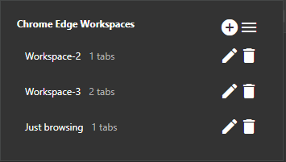
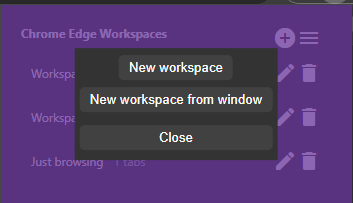
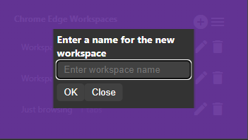
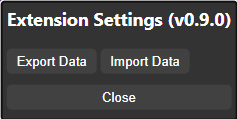

#  Edge Workspaces

**Edge Workspaces** is a Chrome extension that replicates the Microsoft Edge Workspaces feature. It allows you to save the state of a window, including all open tabs, and reopen it later as a workspace.

## Key Features

- **Automatic Saving**: The extension automatically saves your workspace as you work, eliminating the need to manually save open tabs.
- **Import/Export**: Workspaces can be exported to a file and imported later on another device.
- **Internal Tab Exclusion**: Internal Chrome tabs, such as the new tab page, settings, or extensions, are not saved to workspaces.

## Usage

### Creating a Workspace

1. Open the extension popup by clicking the icon in the toolbar (pinning the extension is recommended).
2. Click the "+" icon to open the new workspace modal.
3. Select either "New workspace" or "New workspace from window".
4. Enter a name for the workspace.
5. Click "OK".
6. A new Chrome window will open with the New Tab page.
7. All tabs in the current window will be saved to the workspace as you work.
8. Close the window when finished.

### Opening a Workspace

1. Open the extension popup.
2. Click on a workspace to open it.
3. The saved tabs will be opened in a new Chrome window.

### Managing Workspaces

- Click the trashcan icon to delete a workspace.
- Click the pencil icon to rename a workspace.

### Importing/Exporting Workspaces

1. Open the extension popup.
2. Click the hamburger icon to open the settings window.
3. Click "Export" to save all workspaces to a file.
4. Click "Import" to load workspaces from a file.

## Images

## Install
### Chrome Web Store (Recommended)
Download and add the extension to Chrome from the [Chrome Web Store page](https://chromewebstore.google.com/detail/edge-workspaces/feehlkcbifmladjmmpkghfokcngfkkkp)

### Manual Install
1. Download the latest release from the [releases page](https://github.com/Elec0/chrome-edge-workspaces/releases)
2. Extract the zip file to a permanent location on your computer
3. Open Extensions -> Manage Extensions
4. Ensure Developer Mode is enabled in the top right corner
5. Click Load Unpacked -> Select the extracted folder

## Contribution
Suggestions and pull requests are welcomed!

## Development
1. Clone the repository
2. Run `npm install`
3. Run `npm run build` to build the extension
4. Load the extension in Chrome by following the manual install instructions
5. Run `npm run watch` to automatically rebuild the extension when changes are made

Using VS Code, there are two tasks available:
* `Run npm watch` - Runs `npm run watch`
* `Launch Chrome against localhost` - Launches a new Chrome window with the extension loaded
  * You will need to update extension ID in the `url` in `launch.json` to match the ID of the extension loaded in Chrome

## Credits
* Original extension icon made by [Yogi Aprelliyanto](https://www.flaticon.com/authors/yogi-aprelliyanto) from [Flaticon](https://www.flaticon.com/)
* This project was bootstrapped with [Chrome Extension CLI](https://github.com/dutiyesh/chrome-extension-cli)